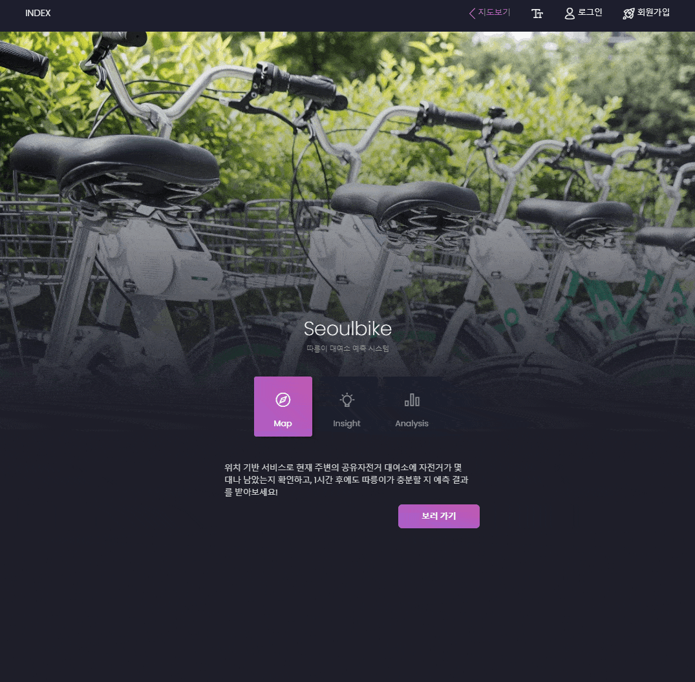

# Seoulbike
<h3>따릉이 수요 예측 웹사이트 프로젝트</h3>

<ul>
<li>제작인원 : 1명</li>
<li>제작기간 : 2022-07-13 ~ 2022-08-11(1달)</li>
<li>제작목적 : 따릉이 대여소의 지도, 각 대여소마다의 실시간 분석결과를 제공하여 따릉이 잠재적 고객의 편의성을 높이기 위한 취지로 제작</li>
<li>프레임워크 : Django v4.0.3 / Vue.js v2.6.14</li>

</ul>
 
 
<h4>구성</h4>
<ul>
<li>backend/ :   백엔드(장고) 폴더</li>
    <ul>
    <li>auth/ :     로그인 사용자의 백엔드 jwt인증을 담당</li>
    <li>config/ :   local, prod의 setting과 관리자 api를 담당</li>
    <li>seoulbike/ :     주기능 app</li>
        <ul>
        <li>buildAnalysis.py :   서버 실행시에 인스턴스를 생성하여 예측결과를 내놓는데 사용하는 Forecast class와 예측을 위한 날씨정보를 얻는데 사용하는 weatherForecast class를 포함</li>
        <li>cron.py :   실시간 정보를 부하없이 제공하기 위해 각 사용자의 호출마다 따릉이 api를 호출하지 않고, 서버에서 5분마다 따릉이 api를 호출한 결과를 저장 후 제공하기 위한 cronjob. 또 1시간마다 그 히스토리를 DB에 저장하여 향후 분석의 window로 사용함.</li>
        <li>models.py :  대여소, 회원, 댓글, 대여히스토리의 모델을 담당</li>
        <li>permissions.py :  비로그인 시에도 서비스를 이용할 수 있도록 IsAdminUserOrReadOnly, IsAuthenticatedOrReadAndWrite를 만듦</li>
        <li>views.py :  ModelViewset을 이용. Admin과 User의 view를 분리. search filter, partial update, 중복 아이디체크, 대여소 즐겨찾기 field의 json pasre, 비밀번호 변경, 비밀번호 확인과 암호화 등을 구현</li>
        </ul>
    <li>static/ :  백엔드에서 사용할 정적 파일들을 보관</li>
         <ul>
        <li>models/ :  각 대여소의 머신러닝 모델</li>
        <li>scalers/ :  각 머신러닝 모델의 X_train을 스케일할 때 사용했던 스케일러</li>
        </ul>
    <li>templates/ :  비밀번호 리셋을 위한 이메일에 첨부할 html을 포함</li>
    </ul>
     
<li>frontend/ : 프론트엔드(vue.js) 폴더 - 이미 만들어진 template을 다운받아 거기서 부터 시작함</li>
    <ul>
    <li>src/</li>
        <ul>
        <li>components/ : 페이지의 구성 요소를 담은 폴더</li>
            <ul>
            <li>Analysis/ : 분석 소개 페이지의 Lazy loading component들</li>
            <li>bike/ : 지도 페이지에서 자주 사용되는 댓글 template과 지도 template을 보관</li>    
            <li>forms/SubmitCard.vue :  form의 일반적인 형태를 구성</li>   
            <li>AnalysisBoard.vue :  대여소의 예측결과와 히스토리를 그래프로 제공하는 component</li>  
            <li>bikeTable.vue :  대여소 테이블 component</li>  
            <li>reviewTable.vue :  댓글의 작성과 수정, 비밀번호 작성, 페이징을 담당하는 component</li> 
            </ul>
        <li>locales/ : 2개 언어 지원을 위한 i18n의 kr.json, en.json을 보관</li>    
        <li>login/auth.js :  jwt 로그인 관리를 위한 localstorage 세팅과 refresh token의 시용 및 재발급을 담당</li>    
        </ul>
        <li>pages/ : 페이지를 담은 폴더</li>
            <ul>
            <li>Forms/ : 회원가입을 위한 Wizard</li>
            <li>seoulbike/ : 관리자 페이지, 마이 페이지, 비밀번호 리셋 페이지, 지도 페이지를 보관</li>    
            <li>EDA-1.vue, EDA-2.vue, MachineLearning.vue : 분석 소개 페이지</li>   
            <li>Seoulbike.vue : 로그인과 지도보기를 할 수 있는 홈페이지</li>  
            </ul>
        <li>plugins/errorHandler.js : 에러 alert 출력을 위한 플러그인</li>
        <li>storage/userspots.js : localStorage를 이용한 대여소 즐겨찾기 기능 구현</li>
        <li>store/index.js : Vuex를 이용한 유저정보 store</li>
    </ul>
</ul>
 
 
<h4>개요</h4>
2015년 시범운행을 시작해 2017년부터 본격적으로 서비스를 시작한 따릉이 공유자전거 대여서비스는 이제는 매우 커져서
대여소만 2000개, 자전거 대수는 5만대에 이르는 거대한 서비스가 되었다. 3년차 정기권을 구매한 필자도 일상에서 자전거를 어디서나 대여해 
돈과 시간도 아끼고, 운동까지 겸할 수 있다는 것이 마음에 들었고, 또 현재도 애용중이다. 따릉이를 이용해 본 적이 있는
사람이라면 알겠지만, 생각보다 대여소가 촘촘히 배치되어 있어, 시가지라면 5분 이내로 걸어서 근처 대여소를 찾을 수 있다.  

다만 사람들이 많은 곳에는 그만큼 자전거 수요도 많아 정작 찾아갔더니 자전거가 부족한 경우가 발생할 수도 있다.
보통 그런 곳에는 설치된 자전거 대여소도 규모가 크지만 수요를 감당하기에는 역부족인것 같다.
홍대, 신도림, 종로, 강남, 건대에서 그와 같은 경험을 했고 근처 다른 대여소로 걸어가는 발걸음은 생각보다 길다.  

따릉이 앱에서는 각 대여소마다 따릉이의 잔여대수를 제공하고 있다. 만약 1대나 2대가 남았다면 서둘러야 한다.
그것을 본 다른 사람들도 서두를 것이기 때문이다. 필자는 본인이 겪은 굉장히 사소하고 시덥잖은 문제에서 해결책을 찾기 위해
소위 '머신러닝'이라고 부르는 간드러지는 데이터분석 기법을 이용해보기로 했다. 2시간 후에 일정이 끝나는 데 근처 대여소에 따릉이가 5대 남았다면? 
내가 있는 곳이 신림동 언덕배기라면 괜찮을 수도 있다. 하지만 마포구 시내라면? 조금 힘들수도 있겠다. 하지만 빌리는 사람이 많은 대여소는 반납하는 사람도 많지
않을까? 그러나 또 이것은 시간에 따라, 요일에 따라 다를 것이다. 이 프로젝트는 이러한
질문에 답하기 위해 시작했다.  

다음은 이 프로젝트로 기대할 수 있는 3가지 스케일의 솔루션이다. 
<ol>
<li>내가 따릉이를 이용 계획을 가질 때, 헛걸음을 하지 않도록 동선을 짜도록 도와준다.</li>
<li>다른 사람들도 따릉이를 이용할 때 같은 혜택을 받을 수 있도록 한다.</li>
<li>따릉이 사업을 관리하는 서울시의 입장에서, 어떤 대여소가 어떤 시간에 추가적인 따릉이 배치가 필요할지 파악하는데 도움을 준다.</li>
</ol>
  
<h4>머신러닝</h4>   
머신러닝 모델을 만드는 것은 여러 측면에서 고역이었는데, 여러가지 시도하고 만들다보니 나중에 알게된 모델의 제약이라던가, 이용가능한 데이터의 한계, 모델의 한계 내지는 속도의 제약 같은 여러가지 문제를 마주했다.  

그 중 가장 큰 문제점은 모델의 인풋과 아웃풋을 결정하는 것이었다. 독립변수들의 정규화를 어떻게 하느냐에 따라 모델의 예측력은 약간의 차이를 보였고,
또 어떤 독립변수를 실제로 골라 모델에 넣을 것인가가 매우 중요했다. 아웃풋(y) 또한 여러 선택지가 있었는데, 예측하려고 하는 것은 임의의 대여소의 자전거 잔여대수이었고
그것을 시간당 지전거의 유입량을 예측함으로써 도출할 수도 있었지만, 더 환원하여 시간당 대여대수, 반납대수를 예측하는 선택을 할 수 있었다.  

두가지 선택지 모두 놓지 않고 시도해보았으나, 유입량으로 예측하는 편의 오차가 더 낮았다.
그러나 어느쪽을 선택하든지, 분포가 0에 치우치는 경향이 있었고, 특히나 시간당 유입량의 경우에는 대부분의 데이터가 0이었다. 그러나 특정 대여소에서 큰 수치로 튀는 이상치들이 확실히
존재했고 이를 정규화하기 위해 cbrt변환을 시도했다. 대여대수와 반납대수를 예측할 때에는 log1p변환을 시도했다. 그 편이 y의 정규화를 더욱 잘 수행했다.  

그 이유는 그렇게 할 때 y가 정규성을 만족할 때 머신러닝의 퍼포먼스가 좋음이 알려져있었기 때문이다. 하지만 그러한 변환은 fitting을 수행할 시에
오차 계산을 제대로 할 수 없게 했다. 때문에 TransformedTargetRegressor를 이용해 fitting을 해보기도 했다. scoring으로 알려진 것은 rmsle, rmse, mae 등이었지만,
대여소 1개소의 자전거의 대수를 예측하려는 서비스의 특성상 mae를 scoring function으로 채택했다. 그러나 결국 왜곡된 y값은 제대로 된 값을 내놓는 데 오히려 악영향을
미쳤고, 결과적으로는 모델이 0에서 약하게 진동하는 값만을 내놓도록 하는 문제점을 보였다.  

필자를 절망하게 한 것은 진동하는 결과만을 내놓는 모델의 오차가 다른 모델의 오차보다 더 뛰어난 경향을 보였다는 것이다. 하지만 그러한 모델로는 서비스를 할 수 없을 것이다. 결국 cbrt 또는 log와 같은 변환을 수행하지 않고 모델을 만들었다. 그것을 결정하는데는 오랜 시간이 걸렸고, 그 때까지는 여러가지 방법론을 시도할 때마다 스케일링을 한 경우의 결과까지 확인해야 했다.  

인풋으로 무엇을 넣을지 결정하는 과정에서 데이콘에서 따릉이를 이용한 분석을 수행한 한 분의 도움을 받아 새로운 feature를 생성할 아이디어를 갖게 되었다.
그 아이디어라는 것이 매우 주효했는데, 이전까지는 갈피를 잘 잡고 있지 못하다가 feature를 생성한다는 것에 대해 눈을 뜨자
여러가지 새로운 시도를 할 수 있게 되었기 때문이다. 또 일전의 '지그재그'에 일직선으로 대처하던 모델보다 낮은 오차를 가지게 되었다.  
그 분은 날씨의 데이터로부터 체감온도라는 feature를 만드셨지만, 필자는 그것 이외에도 약 20여가지의 feature들을 만들었고, 후진제거법으로 최종적으로는
6개의 feature들(불쾌지수, 대여소신설경과일, 2020년여부-코로나 발발로 인한 자전거 수요를 보정하기 위해, 광도, 출근시간여부, 퇴근시간여부)이 최종모델에 포함되었다.
  

정말 컸던 다른 문제는, 구상하고자 하는 서비스가 실제로 어느 환경에서 작동하는지 잘 고려하지 않았기 때문에 생긴 문제였다.   

예를 들면 머신러닝 예측이 잘 진행되지 않아 시계열로 분석을 시도했는데, 시계열분석의 특성상 예측하고자 하는 것이 대여대수라면 대여대수의 window가 제공되어야 한다.
모델을 개발하는 환경에선 데이터가 이미 다 주어진 터라 대여대수의 window를 마련하는 것 따위는 문제가 되지 않겠지만, 실제로 서비스한다면 실시간으로 1시간 단위로 받아올 수 있는 정보는 
서울시에서 제공하는 api였고, 거기서는 대여소의 자전거수 변화만 감지할 수 있었다. 그것은 유입량만을 계산할 수 있는 지표였고, 때문에 대여대수와 반납대수에서 매우 높은 계절성을 보여
잘 해결될 것 같았던 시계열 분석은 무위로 돌아가게 되었다. 유입량을 이용한 시계열 분석은 트렌드와 계절성을 분리한 후에는 kpss 검정에서 정상성을 만족했지만, white noise의 특성을 보여 window의 수를 몇으로 늘리던 이미 있는 모델보다 낮은 오차를 가지는 모델을 만드는데 실패했다.  

또 딥러닝도 시도했다. 딥러닝에 대해 많이 알지 못한다고 생각했기 때문에 KAIST의 youtube강좌와 많은 블로그들을 참조했다. LSTM모델은 시계열 자료를 훈련할 때 좋다고 알려져있었기 때문에 LSTM모델을 사용했으며 구현은 torch로, 여러가지 hyper parameter들을 바꿔가며 시도해 보았다.
활성화 함수로는 ReLu, Optimizer는 ADAM, batch size는 2^10, learning_rate는 0.001, hidden_layer는 70일 때 최적이었고 또 어느정도는 더 좋은 예측을 내놓기는 했다.
그러나 그 차이가 그렇게 크지 않았으며 구글 colab에서 훈련에 필요한 데이터를 불러오는데 시간이 한참 들고 또 걸핏하면 꺼졌는데, 나중에는 이미 많이 이용했다며 gpu를 이용할 권한이 후순위로 밀려나며 많은 불편을 겪었다. 또한 결정적으로 2600개 모델을 훈련시킬 시간이 충분치 않아 다른 방법을 찾는 수밖에 없었다.  

이런 문제들이 다 그렇듯이 진작에 고려했다면 먼 길을 돌아가지 않아도 됐을 것이다. 지금 돌아보면, 좋은 모델을 찾기 위한 열정은 가득했지만 실제로 구동할 서비스의 한계점을 파악하는데 미진했다. 아마 다음 프로젝트를 진행하게 된다면, 이러한 삽질은 피할 수 있을 것이라고 생각한다.  
      

결과적으로 채택한 모델은 Zero Inflated Regressor였다. 위의 사진과 같이, ZIR는 분류기로 먼저 확실하게 0으로 결과가 나올 것 같은 경우를 걸러 낸 후,
회귀를 한다. 그러므로 앞에서 언급했던 '0'이 많은 문제들을 어느정도 해결해 준다. 분류기를 선정할 때에는 0을 전부 걸러낼 수 있을거라 생각하지 않았고 또 그것이
목적이 아니었기 때문에, 확실한 0들을 찾기 위해 Accuracy를 scoring function으로 삼았다.   
여러 분류기와 회귀기를 각각 비교하여 고른 결과 우연히 LGBMClassifier와 LGBMRegressor가 선정되었다. 1만개 이상의 데이터가 있을 경우를 상정한
모델이므로 데이터의 수가 24 x 365(1년)보다 적은 경우에는 모델을 생성하지 않았다. 그 경우에는 대여소 클릭시 '데이터의 부족으로 인해 예측을 제공하지 않는다'는
알림을 볼 수 있을 것이다.   

최종 채택한 모델에서 사용한 feature는 다음과 같다. 월과 시는 원핫인코딩을 했다. 또 유출량 window를 사용해
대여횟수와 반납횟수를 예측하는데, window가 있는 편이 더 좋은 예측을 보여주는 것을 확인했다. '유출량(-49)'는 49시간 이전의 유출량을 의미한다.
1시간 전, 24시간 전이 아니라 49시간 전의 유출량부터 사용한 이유는 서비스에서 제공하고자 하는 예측이 향후 48시간 동안이고, 48시간 후의 예측에서 1시간 전의
window를 사용한다면 지금 가지고 있지 않은, 47시간 이후의 정보를 사용해야 하는 꼴이 되므로 다음과 같이 216시간 전부터 49시간 전까지 1주일간의 window를 사용했다.  

      '기온', '강수량(mm)', '비 또는 눈', '휴일', '불쾌지수', '경과도', '2020년', '광도', '출근',
       '퇴근', '유출량(-49)', '유출량(-72)', '유출량(-73)', '유출량(-96)', '유출량(-97)',
       '유출량(-120)', '유출량(-121)', '유출량(-144)', '유출량(-145)', '유출량(-168)',
       '유출량(-169)', '유출량(-192)', '유출량(-193)', '유출량(-216)', '월', '시'

결과적으로 hyper parameter를 이미 조율한 이전의 모델보다 거의 20% 더 좋은 예측을 보여주었다. 보팅과 블렌딩의 방법을 시도해 보았으나, 큰 차이는 없는 것으로 드러나
최종 모델로 선정하지 않았다.  
    
    
최종모델로 각 대여소마다 데이터를 훈련한 후, 스케일러와 함께 pkl로 저장해 두었다. 백엔드 로직에서는 사용자가 예측 결과를 요청할 때마다
다음과 같은 프로세스가 실행된다. 매 시간 마다 1번 최초 cronjob을 실행하고(따릉이 api와 database에 history저장) 범용dataframe을 만드는 부분에서 약 1초정도 소요되지만, 그 이후로는 
0.5초 이내로 임의의 대여소의 예측결과를 제공해준다. 만약 1시간 이내에 이미 예측된적 있는 대여소라면 저장해둔 결과를 전달해주므로 속도가 훨씬 더 빠르다.

   
<h4>웹페이지</h4>
 
<h6>홈페이지 및 로그인</h6>

<ul>
    <li>로그인, 회원가입, 언어변경, 지도보기 링크 제공</li>
    <li>아이디, 비밀번호 무결성 확인(Vee-validation)</li>
    <li>로그인시 이전에 있었던 페이지로 이동</li>
</ul>
  

<h6>회원가입</h6>

<ul>
    <li>이름, 이메일 등 무결성 확인</li>
    <li>아이디 validation할 시기에 아이디 중복체크</li>
    <li>form에 사진 추가 가능</li>
    <li>지도 기능 탑재(Leaflet)</li>
    <li>지도 기능 사용할 시 GPS로 현재 위치로 이동(vue-geolocation)</li>
    <li>즐겨찾기 스팟은 "123, 456"과 같이 string으로 저장한 후 백엔드에서 처리</li>
</ul>
  

<h6>언어설정</h6>

<ul>
    <li>한국어와 영어, 2개 언어 지원</li>
</ul>
  

<h6>비밀번호 찾기</h6>

<ul>
    <li>회원가입 시 작성한 이메일로 비밀번호 찾기 기능(Django-rest-password-reset)</li>
    <li>gmail stmp 세팅으로 새 비밀번호 설정을 위한 링크를 전송</li>
    <li>token값을 form에 포함하여 전송하고 백엔드에서 처리</li>
</ul>
  

<h6>지도 보기</h6>

<ul>
    <li>메인기능 담당 페이지</li>
    <li>gps기능 허용시, 접속지점 근처로 이동</li>
    <li>맵 위의 개체 수를 일정 수 이내로 유지하도록(렉 방지) 하는 lazy loading</li>
    <li>5분 간격으로 자전거 대수 제공</li>
</ul>
  

<h6>대여소 검색</h6>

<ul>
    <li>차트 기능 제공(chart.js)</li>
    <li>페이징, 검색, 지도이동 및 즐겨찾기 기능이 포함된 테이블</li>
    <li>유저가 즐겨찾기 해놓은 대여소를 모아볼 수 있음. 아이콘과 지도마커의 색상을 다르게 표시하여 구분</li>
    <li>로그인 없이도 서비스를 제공하기 위해 즐겨찾기 정보는 local storage에 저장</li>
    <li>로그인 유저의 경우에는 DB의 내용과 합치고 로그아웃 시에 다시 반영</li>
</ul>
  

<h6>댓글 작성</h6>

<ul>
    <li>대여소마다 댓글 작성</li>
    <li>익명으로도 댓글을 작성할 수 있음(비밀번호 4자리를 입력하여)</li>
    <li>비밀번호 무결성 체크 후 암호화하여 Hash값만 저장(Bcrypto)</li>
</ul>
  

<ul>
    <li>로그인 상태일 경우 비밀번호 없이 댓글 입력</li>
    <li>수정, 삭제 기능 구현</li>
</ul>
  

<ul>
    <li>익명 댓글은 누구나 비밀번호 입력 가능</li>
    <li>비밀번호가 맞을 경우에만 수정기능 버튼을 생성</li>
    <li>비밀번호는 form에 포함되어 전송된 후, 백엔드에서 다시 검증</li>
</ul>
  

<h6>예측 서비스</h6>

<ul>
    <li>차트 기능 제공(chart.js)</li>
    <li>페이징, 검색, 지도이동 및 즐겨찾기 기능이 포함된 테이블</li>
    <li>유저가 즐겨찾기 해놓은 대여소를 모아볼 수 있음. 아이콘과 지도마커의 색상을 다르게 표시하여 구분</li>
    <li>로그인 없이도 서비스를 제공하기 위해 즐겨찾기 정보는 local storage에 저장</li>
    <li>로그인 유저의 경우에는 DB의 내용과 합치고 로그아웃 시에 다시 반영</li>
</ul>
  
